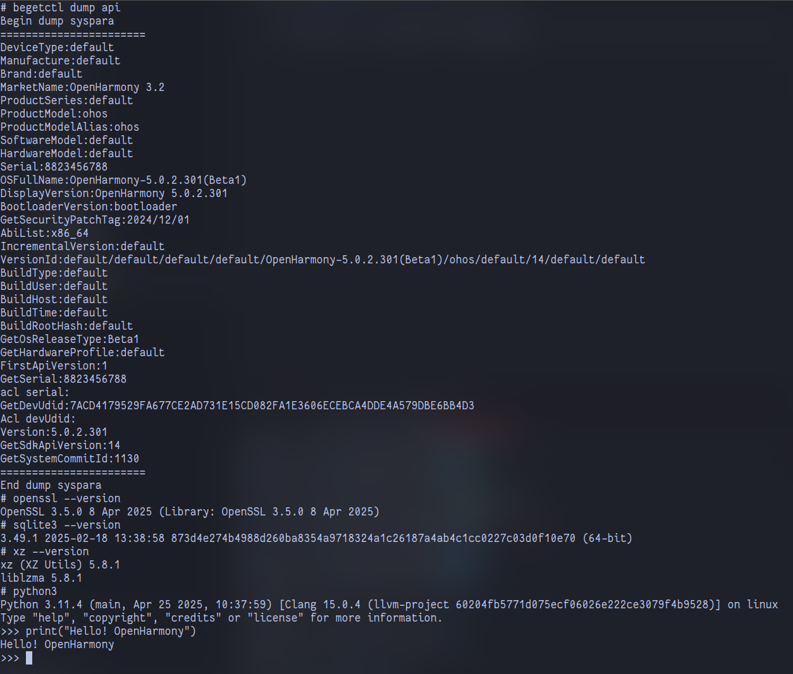
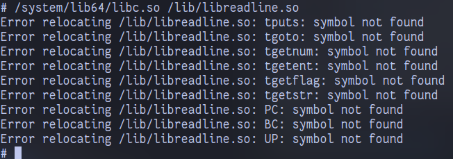

# Python3 for the OpenHarmony Platform

[中文文档](./README_zh.md)

This repository ports Python3 (currently 3.11.4) and some third-party libraries that depend on C/C++ modules to OpenHarmony Edu 5.0.2.

 


## How to build 

Using Ubuntu hosting environment as an example. The OpenHarmony (Edu) SDK needs to be configured. 

- Set the environment variable `OHOS_SDK` (it is recommended to write `.bashrc/.zshrc`) to the root directory of your OpenHarmony (Edu) SDK. Note that it needs to contain the API version number, e.g. `[...] /14`; 

- Install the necessary build tools: 

  ```shell
  sudo apt install \
  	git \
  	wget \
  	unzip \
  	build-essential \
  	autoconf \
  	autopoint \
  	libtool \
  	texinfo \
  	po4a
  ```

- Execute `. /ohos-build.sh -d` (the `-d` parameter means to download the source code of the various dependency libraries) to start the build, the product is located in the `dist/` directory in the same parent directory.


If you want to build third-party Python libraries, you need to mimic `pypkgs-download.sh` to download the relevant repositories, and mimic `scipy-build.sh` to build the third-party libraries manually.

This repository provides some sample built third-party libraries (`numpy`, `scipy`), see Release.


## Known Issues

- ` libreadline.so` is compiled with the Clang toolchain, but still has the problem of not recognizing symbols. Suspect OpenHarmony build toolchain or musl libc system library itself: 

    
