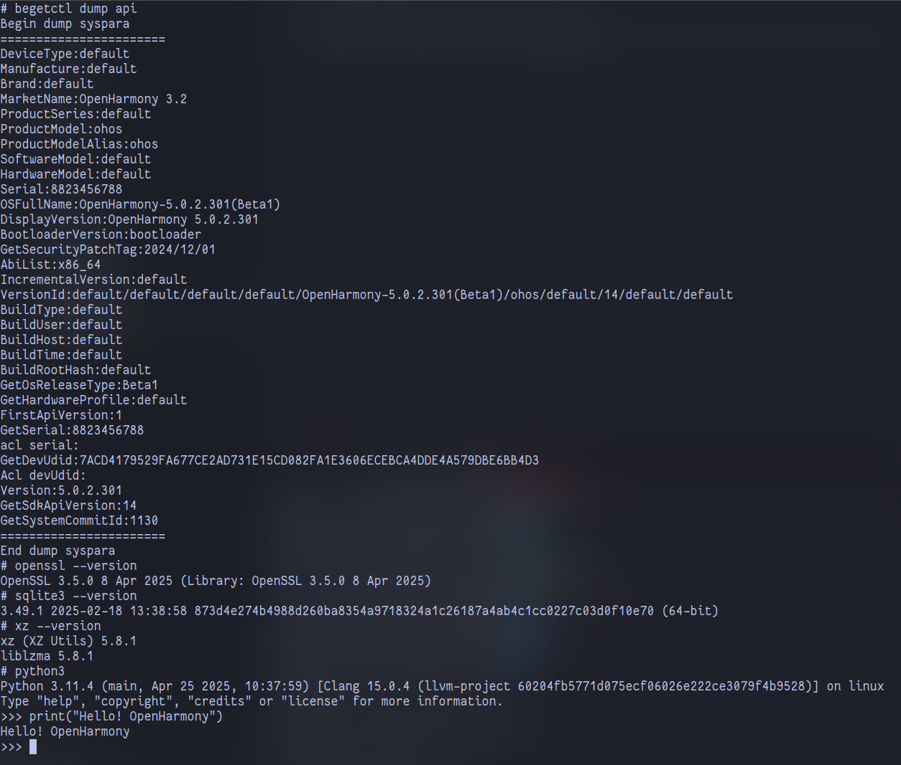
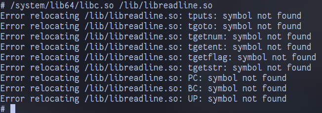

# 适用于 OpenHarmony Edu 平台的 Python3

本仓库将 Python3 (目前 3.11.4) 移植到 OpenHarmony Edu 5.0.2。




## 如何构建

以 Ubuntu 宿主机环境为例。需要配置 OpenHarmony (Edu) SDK。

- 设置环境变量 `OHOS_SDK`（建议写入 `.bashrc/.zshrc`）为你的 OpenHarmony SDK 的根目录。请注意，它需要包含 API 版本号，例如 `[...]/14`；

- 安装必要构建工具：

  ```shell
  sudo apt install \
  	build-essential \
  	texinfo \
  	po4a
  ```

- 执行 `./ohos-build.sh -d`（`-d` 参数表示下载各种依赖库的源码）开始编译，产物位于同父目录下的 `dist/` 目录中。


## 已知问题

- `lib-dynload` 下的 Python 模块无法加载 `libpython3.so` 中的符号；

- `libreadline.so` 通过 Clang 工具链的编译，但是还是出现无法识别符号的问题。怀疑是 OpenHarmony 编译工具链或 musl libc 系统库自身问题：

    